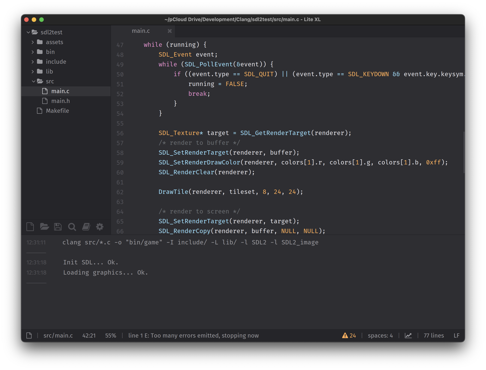

Monatelang habe ich mich über bisher zum Programmieren genutzte Texteditoren geärgert. TextMate verwendt unkonventionelle Tastaturkürzel für Ein- und Ausrückung mehrerer Zeilen. BBEdit hat lieblose Syntaxfärbung. Visual Studio Code fühlt wie ein komplettes IDE an, das noch dazu den Akku leer saugt und meine komplette Festplatte sowie den Speicher belegt.

Auftritt [Lite XL](https://lite-xl.com/). Das ist ein leichtgewichtiger Texteditor, der in C and Lua geschrieben ist. Gerade in den vergangenen 6 Monaten hat sich einiges getan. Damit ist er zu meinem neuen Favoriten geworden.

- ☑️ Sieht super aus
- ☑️ Ist schnell und genügsam
- ☑️ Kann optimal angepasst werden
- ☑️ Hat schöne Syntaxfärbung
- ☑️ Unterstützt LSP
- ☑️ Verfügt über eine praktische Terminal-Integration
- ☑️ Läuft nativ auf macOS und Apple Chips

## Lite XL

Die jeweils benötigte Version für macOS (x86 für Intel, arm64 für Apple Chips) ist auf der [GitHub Releases-Seite](https://github.com/lite-xl/lite-xl/releases/) verfügbar.

Um die frisch heruntergeladene macOS-Version für Apple Chips starten zu können, ist es nötig, mittels `xattr´ die erweiterten Attribute entsprechend zu setzen. Die Optionen `-rc` sorgen dafür, dass für das gesamte App-Bundle die Attribute zurückgesetzt werden.

```bash
xattr -rc /Applications/Lite\ XL.app
```

Alternativ kann Lite XL auch direkt aus den Quelltexten kompiliert werden. Die dazu benötigten Bibliotheken sind über den Package-Manager [Homebrew](https://brew.sh/) verfügbar.

```bash
brew install lua
brew install pkg-config
brew install meson
brew install freetype
brew install pcre2
```
Vorgehensweise für macOS:

```bash
cd /path/to/lite-xl/
bash build-packages.sh -r
meson setup --buildtype=release -Dbundle=true --prefix / build
meson compile -C build
DESTDIR="$(pwd)/Lite XL.app" meson install --skip-subprojects -C build
```

<figure>
	
	<figcaption>Lite XL mit LSP- und Console-Erweiterungen</figcaption>
</figure>

## Die wichtigsten Erweiterungen

Schon in der Standard-Ausstattung ist Lite XL gut. Aber mit wenigen Erweiterungen lässt sich der Editor wirklich erstaunlich verbessern — so dass er für mich definitiv die anderen üblichen Verdächtigen auf dem Mac ersetzen kann.

Alle Erweiterungen können hier heruntergeladen werden: [Lite XL-Plugins](https://github.com/lite-xl/lite-xl-plugins).

### autoinsert

Diese Erweiterung fügt automatisch schließende Klammern und Anführungszeichen ein. Außerdem lässt sich markierter Text mit Klammern oder Anführungszeichen umschließen.

### bracketsmatch

Zusammengehörige Klammer-Paare werden unterstrichen. Nicht unbedingt überlebenswichtig, aber sehr praktisch.

### console

Die denkbar einfachste und praktischste Bash-Integration. Die Tastaturkürzel auf dem Mac weichen von der Beschreibung ab:

- `Cmd+.` Terminal ein- und ausblenden
- `Cmd+Shift+.` Befehl ausführen

Je nach dem welche Befehle man in der Konsole nutzen möchte, müssen ggf. Suchpfade in der `.bashrc` ergänzt werden. Bei mir waren das die folgenden:

```bash
PATH=/usr/local/bin:$PATH
PATH=/opt/homebrew/bin:$PATH
PATH=/usr/local/share/dotnet:$PATH
```

### ipc

Diese Erweiterung liefert für die Inter-Process-Communication. Das ist relevant, wenn man konfigurieren möchte, dass – wie für macOS typisch – nur eine Instanz der Anwendung gestartet wird (siehe `init.lua` weiter unten).

### lsp & lint+ (und widgets)

Language Server Protocol-Integration (z. B. für clang und lua-language-server) mit Linter. Sehr praktisch. Auf diese Weise werden Fehler angezeigt und es ist möglich, direkt zu Funktionen etc. innerhalb des Quelltexts zu springen (z. B. mit `Cmd+Shift+P` und dann `View Document Symbols`).

Optional gehört dazu auch die widgets-Bibliothek.

### settings

Die Erweiterung bietet eine grafische Oberfläche für die Core- und Plugin-Einstellungen, Tastenkürzel und Farbthemen. Benötigt die widgets-Bibliothek.

Bei der Download-Version von Lite XL scheint diese Erweiterug standardmäßig in der Mac-Version enthalten zu sein. Kompiliert man jedoch Lite XL selbst, muss die Datei `settings.lua` manuell dem Pfad `~/.config/lite-xl/plugins` hinzugefügt werden.

## Einstellungen

Die wichtigsten Einstellungen in der `~/.config/lite-xl/init.lua`. Allerdings kann die Anpassung der Einstellungen auch über die integrierte Oberfläche in Lite XL vorgenommen werden — sowohl für die Anwendung wie auch die installierten Erweiterungen.

```lua
local core = require "core"
local keymap = require "core.keymap"
local config = require "core.config"
local style = require "core.style"

-- set maximum number of files
config.max_project_files = 80 -- default 50

-- use Fira Code
style.code_font = renderer.font.load("/Users/marc/Library/Fonts/Fira_Code_v6.2/FiraCode-Regular.ttf", 16 * SCALE)

-- use only one instance of Lite XL and
-- don't open new instances for each project
config.plugins.ipc.dirs_instance = "change"

-- init language servers
-- 'config.lua' is included with lsp plugin
local lspconfig = require "plugins.lsp.config"
-- clangd setup
lspconfig.clangd.setup()
-- lua-language-server setup
-- get location using 'where lua-language-server' in Terminal
lspconfig.sumneko_lua.setup {
  command = {
    "/opt/homebrew/bin/lua-language-server",
    "-E",
    "/opt/homebrew/bin/lua-language-server/main.lua"
  },
  settings = {
    Lua = {
      diagnostics = {
        enable = false
      }
    }
  }
}
```

## Weitere Infos

- Fragen und Antworten zu Lite XL: https://lite-xl.com/en/about/faq
- Mehr zur Syntaxfärbung: https://lite-xl.com/en/tutorials/syntax-highlighting